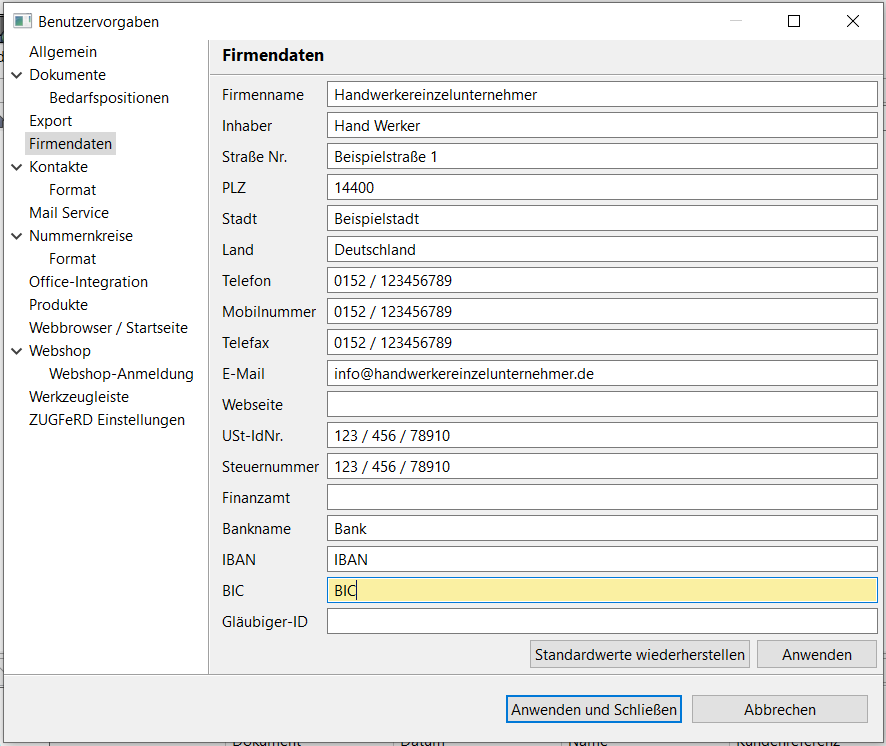
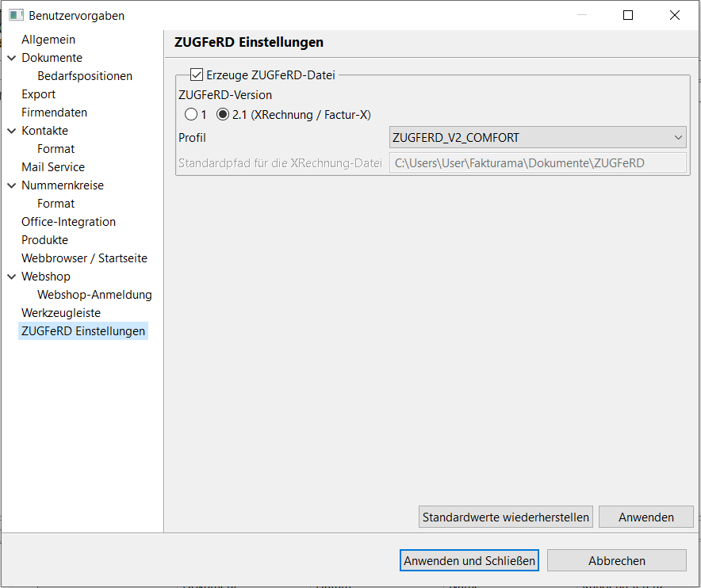
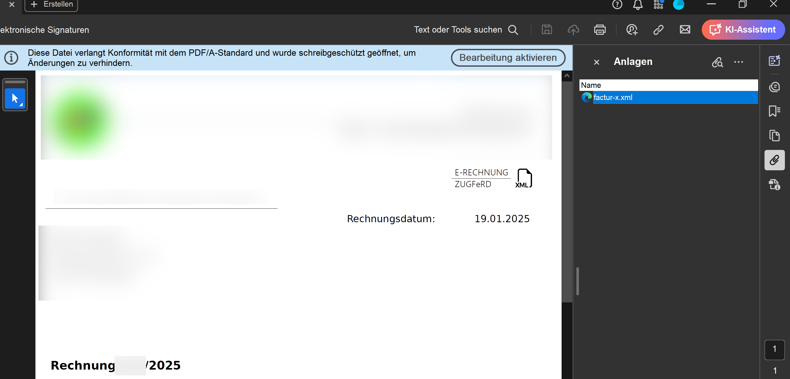

# eRechnung Werkstatt

eRechnung Werkstatt ist ein nodejs-Skript, welches eine nach [ZUGFeRD](https://www.ferd-net.de/standards/zugferd) erstellte eRechnung im PDF-Format hinsichtlich ihrer Konfirmität zum eRechnung-Standard repariert.

## Hintergrund
Die Erstellung einer eRechnung zwingt viele Unternehmer (insbeonere kleine Firmen und Einzelunternehmer) von einer jahrzehntelang gängigen Praxis abzuweichen, Rechnungen in einem simplen Textverarbeitungsprogramm zu erstellen. Eine Rechnung wird nämlich erst dadurch zur eRechnung, indem sie relevante Fiskalinformationen in einem definierten XML-Format speichert. Dieses Format können Textverarbeitungsprogramme wie z.B. MS Word nicht ohne Zusatzprogramme erzeugen.
Alternativ müssen für die Rechnungslegung nun gänzlich neue Programme, bzw. Buchhaltungsapplikationen eingesetzt werden, die dieses Format beherschen, die besagte XML-Datei erzeugen und nach Bedarf in eine PDF-Rechnung einbetten können, was diese dann zur sog. eRechnung macht.
Die Art der Rechnungslegung, insbesondere für kleine Selbstständige lässt sich nach meiner Erfahrung also wie folgt chronologisch resumieren:
- bis ca. Mitte der 1990er Jahre: Rechnungserstellung mittels einer Schreibaschine
- ab ca. Mitte der 1990er Jahre hält der PC Einzug in die Büros, die Rechnungslegung erfolgt fortan mit Textverarbeitung wie MS Word
- ab 01.01.2025 zwingt die Einführung der eRechnung MS Word zu erweitern oder dedizierte Buchhaltungssoftware einzusetzen

## Open Source Buchhaltungssystem
Es gibt viele kommerzielle Buchhaltungs- und Büroapplikationen von namenhaften Herstellern. Alternativ bieten sich auch OpenSource Anwendungen an. Eine davon ist [FAKTURAMA](https://www.fakturama.info/).
Sie unterstützt neben vielen anderen Büroabläufen auch das Erstellen von Rechnungen und kann also die Fiskaldaten als XML-Datei in ein generiertes PDF einbetten.
Ihre zum Zeitpunkt dieses Textes aktuelle Version 2.1.3c erzeugt diese Datei aber in gewissen Situationen nicht ganz Standardkonform, was mit der  eRechnungWerkstatt repariert werden kann. Die Prüfung der Validität der eingebetten XML-Datei lässt sich z.B. mit dem [E-Rechnungs-Validator](https://erechnungsvalidator.service-bw.de/) aus Baden-Württemberg prüfen.

## Welche Fehler kann die eRechnungWerkstatt reparieren?
Die von Fakturama 2.1.3c erzeugten eRechnungen weisen beim Validator situationsbedingt folgende Probleme auf:
1. PEPPOL-EN1631-R10: Email vom Rechnungsempfänger fehlt u.U.
    - Die Werkstatt fügt hier einfach "noreply@something.com" ein
1.  PEPPOL-EN16931-R001 (BT-23): Gechäftsprozess Deklaration fehlt
    - Die Werkstatt fügt hier urn:fdc:peppol.eu:2017:poacc:billing:01:1.0 ein
1. BR-DE-21 (BT-24): Die Ausweisung der genutzten Version des Standards ist nicht korrekt
    - Die Werkstatt setzt hier urn:cen.eu:en16931:2017#compliant#urn:xeinkauf.de:kosit:xrechnung_3.0
1. Leere Elemente in der XML-Datei sind ungültig
    - die Werkstatt entfernt ram:GlobalID und ram:SpecifiedLegalOrganization wenn sie leer sind
1. Steuernummer ist falsch deklariert, wenn Kleinunternehmer keine EU VAT ID hat
    - die Werkstatt setzt hier ram:SpecifiedTaxRegistration/ram:ID auf schemeID 'FC'
1. Rechnungsbeträge sind an verschiedenen Stellen in der XML-Datei nicht identisch
    - die Werkstatt synchonisiert ram:BasisAmount mit ram:LineTotalAmount und ram:CalculatedAmount mit ram:TaxTotalAmount

## Wie erzeugt man eine eRechnung mit Fakturama und bringt sie danach in die Werkstatt?

### Einmalige Einrichtungsaufgaben
1. Installiert zuerst [Fakturama 2.1.3c](https://www.fakturama.info/)
1. Installiert schließend die neuste Version von [LibreOffice](https://www.libreoffice.org/download/download-libreoffice/), Fakturama nutzt es, um PDF-Dateien zu erzeugen
1. Öffnet LibreOffice Writer, erstellt ein Dokument und exportiert es einmal nach PDF, um diese PDF-Erstellung ordnungsgemäß zu initialisieren.
1. Installiert euch die neuste Version von [nodejs](https://nodejs.org/en/download), die eRechnungWerkstatt funktioniert sonst nicht.
1. Ladet euch diese eRechungWerkstatt herunter und speichert sie in einem Verzeichnis eurer Wahl, z.B. "C:\eRechungWerkstatt"
1. Öffnet eine Kommandozeile (Start->"cmd") und gebt diese Befehle ein um benötigte Softwarepakete für die eRechnungWerkstatt zu installiern:
    ```
    cd "C:\eRechungWerkstatt"
    npm install
    ```
1. Legt anschließend fest, wo die Werkstatt reparierte PDF-Dateien ablegen soll. In der Datei main.js müsst ihr dazu den Dateipfad der Variable "outputPath" setzen, z.B.
    ```
    const outputPath = 'C:\\eRechungWerkstatt\\reparierteRechnungen';
    ```
1. Auf dem Desktop erzeugt ihr nun eine Verknüpfung zur Werkstatt. Tragt als Programmziel diesen Wert ein und passt ggf. die Pfade an:
    ```
    "C:\Program Files\nodejs\node.exe" "C:\eRechungWerkstatt\main.js"

    Ausführungspfad (Arbeitsverzeichnis): "C:\Program Files\nodejs"
    ```
1. In Fakturama tragt ihr nun in den Einstellungen eure Unternehmensdaten ein
Datei -> Einstellungen > Firmendaten

1. Aktiviert die Erstellung von eRechnungen in Fakturama:
Datei -> Einstellungen -> ZUGFeRD Einstellungen
Aktiviert den Haken "Erzeuge ZUGFeRD-Datei", setzt als Version 2.1 und wählt das Profil ZUGFERD_V2_COMFORT

### Der neue Rechnungserstellungsprozess
1. Erstellt nun eine neue Rechnung, setzt insbesondere die auch die Kundenreferenz des Rechungsempfängers. Arbeitet ihr für öffentliche Auftraggeber, könnt ihr diese Leitweg-IDs Online finden, in Brandenburg z.B. [hier](https://mdfe.brandenburg.de/sixcms/media.php/9/Leitweg-ID-Gesamtverzeichnis_Land_Brandenburg_2024-07-31.pdf)
1. Druckt die Rechnung in Fakturama. Dieser Vorgang erzeugt eine OpenOffice odt-Datei und eine PDF-Datei.
1. Die gedruckte PDF-Datei aus Fakturama zieht ihr nun ganz einfach per Drag & Drop auf die Verknüfung zu dieser eRechnungWerkstatt (siehe Punkt 8). Es öffnet sich kurz ein Konsolenfenster, das sich autom. wieder schließt. Anschießend sollte im Ausgabe-Ordner (outputPath) die reparierte eRechnung liegen.
1. Offnet die PDF-Datei mit Acrobat. Klickt auf die Büroklammer um die eingebettete PDF-Datei als Anhang zu sehen. Öffnet die Datei durch Doppelklick und speichert sie bei Bedarf als XML-Datei ab, um sie zur Kontrolle mit dem [E-Rechnungs-Validator](https://erechnungsvalidator.service-bw.de/) vor dem Versand zu prüfen.

1. Druckt die eRechnung nach belieben aus und sendet sie an den Rechnungsempfänger per E-Mail. Der Empfänger kann die PDF-Datei, bzw. die eingebettete XML-Datei in seine Applikationen importieren und dort standardkonform digital weiterverarbeiten.

## Ausblick
Der einzige Meilenstein in der Roadmap von diesem Projekt ist es, mit einer zukünftigen FAKTURAMA-Version wieder überflüssig zu werden 😊
